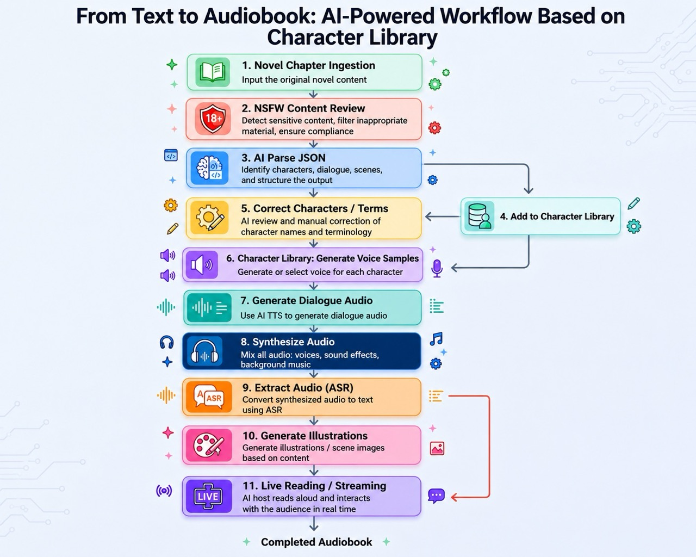

# AI-NovelSpeaker-V2

[简体中文](README.md) | [繁體中文](README.zh-TW.md) | [English](README.en-US.md) | [日本語](README.ja-JP.md) | [한국어](README.ko-KR.md)

Multi-novel management and audio generation toolkit (SQLite + local file storage + ComfyUI + LLM).

## Novel To Audiobook Flow



## Video Introduction

- Bilibili: https://www.bilibili.com/video/BV136AKzcE2c
- YouTube: https://youtu.be/pVB0qMpFdqg

## Donate

If this project helps you, donations are welcome to support continued development.

| Alipay | WeChat Pay |
| --- | --- |
|  |  |

## Features

- Novel management: create/edit/delete novels, project stats, auto refresh, real ZIP bundle export, novel-level prompt/workflow binding, and cached total audio duration refresh
- Chapter management: chapter CRUD, content viewing/copying, chapter search, AI-to-JSON, JSON view/edit/find-replace, role viewing, line preview/generation, and chapter audio playback/download/merge
- Line audio: single-line generation, batch generation into the line-audio queue, immediate or scheduled execution, task details/playback/delete, and active pending/running counts
- Role library: role management, level filtering, chapter role comparison, sample audio upload/generation, and voice text extraction
- Task queues: JSON queue and line-audio queue with filtering and auto refresh; audio merge warns about missing line audio
- Prompts & workflows: system/user template management, copy-to-user workflows, three workflow categories, input/output node mapping, workflow log toggle, and system/user workflow switching
- Workflow logs: records call time, workflow category, workflow name, final JSON submitted to ComfyUI, and error logs; supports clearing all logs
- Novel downloads: dedicated chapter-audio download page with chapter number, title, word count, duration, size, and download links
- Settings: ComfyUI URL, LLM parameters, Proxy, batch text length, line queue execution mode, UI language, and timezone
- Multilingual UI: supports `zh-CN` / `zh-TW` / `en-US` / `ja-JP` / `ko-KR`
- Audio experience: chapter audio, line audio, and merged audio all support seeking via the progress bar
- Debugging & docs: includes ComfyUI debug workflows, low-memory workflow samples, debug assets, and the “novel to audiobook” flow diagram

## Important Paths

- `app_server.py`: app entry
- `server/startup.py`: startup flow
- `server/http_handler.py`: HTTP routing
- `server/services.py`: core services
- `scripts/init_storage.py`: DB/folder initialization
- `prompts/xhz_system_prompt.txt`: system prompt file
- `workflows/*.json`: built-in ComfyUI workflow files
- `debug/`: ComfyUI debug workflow screenshots, JSON files, and sample assets
- `output/`: local export directory (directory is tracked, generated files are ignored)

## Startup

### Prerequisites

- Python 3.10+ (3.11/3.12/3.13/3.14 recommended)
- FFmpeg (required for audio processing and chapter video export)
- Optional: ComfyUI (for audio generation)

`start.sh` / `start.bat` automatically creates the project-local virtual environment `.venv` and installs Python dependencies from `requirements.txt`. Do not install project dependencies into Homebrew/system Python directly.

On macOS, install FFmpeg with Homebrew:

```bash
brew install ffmpeg
```

On Windows, install FFmpeg and make sure `ffmpeg.exe` is available in `PATH`.

### Clone Repository

```bash
 git clone git@github.com:qzw881130/AI-NovelSpeaker-V2.git
 # or: git clone https://github.com/qzw881130/AI-NovelSpeaker-V2.git
 cd AI-NovelSpeaker-V2
```

### macOS / Linux

```bash
chmod +x start.sh
./start.sh
```

```bash
./start.sh --help
./start.sh --port=8081
```

### Windows

Double-click `start.bat`, or run:

```bat
start.bat
start.bat --help
start.bat --port=8081
```

The startup scripts automatically create `.venv`, install `requirements.txt`, initialize `data/novels.db` if needed, and print local/LAN URLs.

## Chapter Video Export Dependencies

- MP4 export uses Pillow + FFmpeg on the backend.
- Pillow is installed into `.venv` from `requirements.txt`.
- FFmpeg must be available as the `ffmpeg` command.
- Video export runs in a separate subprocess; `stop.sh` / `stop.bat` also stops video export subprocesses.

## Bundle Export Rules (Download Bundle)

- ZIP files are generated in local `output/`
- ZIP filename format: `{english_dir}-{YYYY-MM-dd_HHmm}.zip`
- Extracted structure does **not** include the `output/` prefix:
  - `{english_dir}/audio/*.flac`
  - `{english_dir}/text/*.txt`
- File naming format: `chapterNo_title`
  - Audio: `001_Chapter_One_Sunset.flac`
  - Text: `001_Chapter_One_Sunset.txt`

## ComfyUI Notes

### Debug Workflows and Low-Memory Samples

- `debug/qwen3-tts-generate-character-samples-no-llm.json`: Qwen3 TTS character sample generation
- `debug/fishaudio-s2-tts-generate-dialogue-audio.json`: FishAudio S2 dialogue generation
- `debug/extract-voice-text.json`: Whisper voice-to-text debug workflow
- `debug/line_audio_workflow_qwen3-tts.png`: low-memory Qwen3 TTS line-audio workflow screenshot
- `debug/voice_transcribe_workflow_qwen3-asr.png`: low-memory Qwen3-ASR transcribe workflow screenshot
- `debug/1-旁白.flac`: sample reference audio used by debug workflows

### Workflow Configuration

- The app currently supports three workflow categories:
  - `Voice Sample`
  - `Line Audio`
  - `Voice Transcribe`
- Each workflow can define input/output node mappings:
  - Voice sample: inputs `voice description`, `line text`; output `generated audio file`
  - Line audio: inputs `reference audio`, `line text`, `reference text`; output `generated audio file`
  - Voice transcribe: input `audio file`; output `extracted text`
- System workflows use built-in default mappings and are read-only. When copied to a user workflow, the mapping is copied too.
- Workflow logging is enabled by default. When enabled, the app stores the final workflow JSON actually submitted to ComfyUI; when disabled, no workflow log is recorded for that workflow.
- Workflow JSON supports both ComfyUI API prompt format and graph-export format (`nodes` / `links`).

### Required Third-Party Nodes

| Plugin | Repository | Nodes used in this project |
| --- | --- | --- |
| Qwen3-TTS ComfyUI | [flybirdxx/ComfyUI-Qwen-TTS](https://github.com/flybirdxx/ComfyUI-Qwen-TTS) | `FB_Qwen3TTSVoiceDesign`, `FB_Qwen3TTSVoiceClone` |
| ComfyUI-FishAudioS2 | [Saganaki22/ComfyUI-FishAudioS2](https://github.com/Saganaki22/ComfyUI-FishAudioS2) | `FishS2VoiceCloneTTS` |
| ComfyUI_Comfyroll_CustomNodes | [Suzie1/ComfyUI_Comfyroll_CustomNodes](https://github.com/Suzie1/ComfyUI_Comfyroll_CustomNodes) | `CR Text` |
| ComfyUI-MTB | [melMass/comfy_mtb](https://github.com/melMass/comfy_mtb) | `Load Whisper (mtb)`, `Audio To Text (mtb)` |
| ComfyUI-Custom-Scripts | [pythongosssss/ComfyUI-Custom-Scripts](https://github.com/pythongosssss/ComfyUI-Custom-Scripts) | `ShowText\|pysssss` |
| Comfyui_SynVow_Qwen3ASR | [shumoLR/Comfyui_SynVow_Qwen3ASR](https://github.com/shumoLR/Comfyui_SynVow_Qwen3ASR) | `Qwen3ASRLoader`, `Qwen3ASRTranscribe` |

Notes: `LoadAudio`, `SaveAudio`, `Text Multiline`, and similar nodes come from ComfyUI Core, not third-party plugins.

### Models Used

- Qwen3 TTS:
  - `Qwen/Qwen3-TTS-12Hz-1.7B-Base`
  - `Qwen/Qwen3-TTS-12Hz-1.7B-VoiceDesign`
  - `Qwen3-TTS-1.7B` (low-memory line-audio workflow)
- Fish Audio S2:
  - `s2-pro-fp8`
- Whisper:
  - `large-v3`
- Qwen3 ASR:
  - `Qwen3-ASR-1.7B`

### Built-In Workflows and Dependencies

| Workflow file | Purpose | Key third-party nodes | Required models |
| --- | --- | --- | --- |
| `workflows/voice_sample_workflow.json` | Generate role sample audio | `FB_Qwen3TTSVoiceDesign`, `CR Prompt Text` | `Qwen/Qwen3-TTS-12Hz-1.7B-Base`, `Qwen/Qwen3-TTS-12Hz-1.7B-VoiceDesign` |
| `workflows/line_audio_workflow.json` | Generate line audio | `FishS2VoiceCloneTTS`, `CR Prompt Text` | `s2-pro-fp8` |
| `workflows/voice_transcribe_workflow.json` | Extract text from reference audio | `Load Whisper (mtb)`, `Audio To Text (mtb)`, `ShowText\|pysssss` | [QwenLM/Qwen3-TTS](https://github.com/QwenLM/Qwen3-TTS) |
| `workflows/line_audio_workflow_qwen3-tts.json` | Low-memory line audio generation | `FB_Qwen3TTSVoiceClone`, `CR Prompt Text` | `Qwen3-TTS-1.7B` |
| `workflows/voice_transcribe_workflow_qwen3-asr.json` | Low-memory voice transcription | `Qwen3ASRLoader`, `Qwen3ASRTranscribe`, `ShowText\|pysssss` | `Qwen3-ASR-1.7B` |

## Pages

- `index.html`: novel management
- `chapters.html`: chapter management
- `json-tasks.html`: JSON tasks
- `audio-queue.html`: audio queue
- `line-audio-tasks.html`: line-audio task queue
- `roles.html`: role library
- `novel-download.html`: novel downloads
- `prompts.html`: prompt management
- `workflows.html`: workflow management
- `workflow-logs.html`: workflow logs
- `settings.html`: settings
- `novel-capture.html`: novel capture
