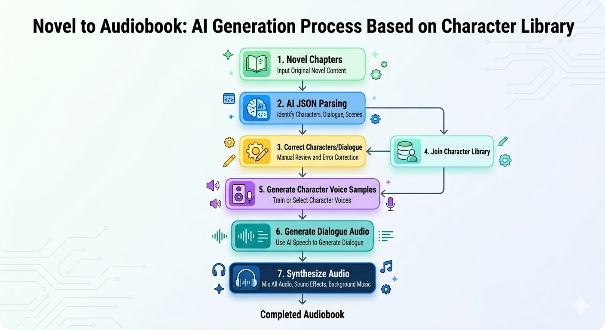

# AI-NovelSpeaker-V2

[简体中文](README.md) | [繁體中文](README.zh-TW.md) | [English](README.en-US.md) | [日本語](README.ja-JP.md) | [한국어](README.ko-KR.md)

複数小説管理 + 音声生成ツール（SQLite + ローカルファイル保存 + ComfyUI + LLM）。

## 小説を音声化する流れ



## 動画紹介

- Bilibili：https://www.bilibili.com/video/BV136AKzcE2c
- YouTube：https://youtu.be/pVB0qMpFdqg

## 機能

- 小説管理：小説の作成/編集/削除、プロジェクト統計、自動更新、ZIP バンドル出力、小説単位のプロンプト/ワークフロー紐付け、総音声長の更新とキャッシュ
- 章管理：章 CRUD、本文の表示/コピー、章検索、AI→JSON、JSON の表示/編集/検索置換、役割表示、台詞プレビューと生成、章音声の再生/ダウンロード/結合
- 台詞音声：1行単位生成、まとめて生成して台詞タスクキューへ投入、即時または指定時刻実行に対応；タスクページでは自動更新、詳細、再生、削除、pending/running 件数表示をサポート
- 役割ライブラリ：役割管理、レベル絞り込み、章内役割比較、役割ライブラリへの追加/置換、サンプル音声のアップロード/生成、音声テキスト抽出に対応
- タスクキュー：JSON タスクキューと台詞音声タスクキューを提供し、状態表示、小説ごとの絞り込み、自動更新をサポート；音声結合前には未生成台詞数を案内
- プロンプトとワークフロー：システム/ユーザーテンプレート管理、ユーザーテンプレートへのコピー対応；ワークフローは3カテゴリで表示され、入出力ノード設定、ログ切替、システム/ユーザーワークフロー切替に対応
- ワークフローログ：実行時間、ワークフロー種別、ワークフロー名、ComfyUI に送信した最終 JSON、エラーログを記録し、全件削除に対応
- 小説ダウンロード：章番号、章タイトル、文字数、音声長、音声サイズ、ダウンロードリンクを表示する専用ページを提供
- システム設定：ComfyUI URL、LLM パラメータ、Proxy、バッチ文字数、台詞キュー実行方式、UI 言語とタイムゾーン設定
- 多言語 UI：`zh-CN` / `zh-TW` / `en-US` / `ja-JP` / `ko-KR` をサポート
- 音声体験：章音声、台詞音声、結合音声でシークバーによる早送りに対応
- デバッグとドキュメント：ComfyUI debug ワークフロー、低VRAM用ワークフロー例、デバッグ用音声サンプル、「小説を音声化する流れ」図を提供

## 主なパス

- `app_server.py`：サーバー起動
- `server/startup.py`：起動処理
- `server/http_handler.py`：HTTP ルーティング
- `server/services.py`：コアサービス
- `scripts/init_storage.py`：DB/ディレクトリ初期化
- `prompts/xhz_system_prompt.txt`：システムプロンプト
- `workflows/*.json`：内蔵 ComfyUI ワークフローファイル
- `debug/`：ComfyUI デバッグ用スクリーンショット、JSON、サンプル資産
- `output/`：ローカル出力ディレクトリ（ディレクトリは追跡、生成物は無視）

## 起動

### 前提

- Python 3.10+（推奨 3.11/3.12/3.13）
- 任意：ComfyUI（音声生成に使用）

### リポジトリ取得

```bash
 git clone git@github.com:qzw881130/AI-NovelSpeaker-V2.git
 # または: git clone https://github.com/qzw881130/AI-NovelSpeaker-V2.git
 cd AI-NovelSpeaker-V2
```

### macOS / Linux

```bash
chmod +x start.sh
./start.sh
```

```bash
./start.sh --help
./start.sh --port=8081
```

### Windows

`start.bat` をダブルクリック、または実行：

```bat
start.bat
start.bat --help
start.bat --port=8081
```

## バンドル出力ルール（Download Bundle）

- ZIP はローカル `output/` に生成
- ZIP 名：`{英語ディレクトリ名}-{YYYY-MM-dd_HHmm}.zip`
- 展開後は `output/` を含まない構成：
  - `{英語ディレクトリ名}/audio/*.flac`
  - `{英語ディレクトリ名}/text/*.txt`
- ファイル名：`章番号_章タイトル`
  - 音声：`001_第一章_落日.flac`
  - テキスト：`001_第一章_落日.txt`

## ComfyUI 依存説明

### デバッグワークフローと低VRAMサンプル

- `debug/qwen3-tts-generate-character-samples-no-llm.json`：Qwen3 TTS 役割サンプル音声生成
- `debug/fishaudio-s2-tts-generate-dialogue-audio.json`：FishAudio S2 台詞音声生成
- `debug/extract-voice-text.json`：Whisper 音声→テキスト デバッグワークフロー
- `debug/line_audio_workflow_qwen3-tts.png`：Qwen3 TTS 低VRAM台詞音声ワークフローのスクリーンショット
- `debug/voice_transcribe_workflow_qwen3-asr.png`：Qwen3-ASR 低VRAM文字起こしワークフローのスクリーンショット
- `debug/1-旁白.flac`：FishAudio S2 デバッグワークフローで使う参考音声サンプル

### ワークフロー設定について

- 現在サポートするワークフロー種別は3つです：
  - `生成示例音声`
  - `生成台詞音声`
  - `提取声音文本`
- 各ワークフローでは入出力ノードマッピングを設定できます：
  - 役割サンプル音声：入力 `音色説明`、`台詞`；出力 `生成された音声ファイル`
  - 台詞音声：入力 `参考音声ファイル`、`台詞`、`参考音声テキスト`；出力 `生成された音声ファイル`
  - 音声テキスト抽出：入力 `音声ファイル`；出力 `抽出テキスト`
- システムワークフローは既定マッピングを使い編集不可です。ユーザーワークフローへコピーするとマッピングも複製されます。
- ワークフローログはデフォルトで有効です。有効時は ComfyUI に送信した最終 JSON を記録し、無効時はそのワークフローの実行ログを保存しません。
- ワークフロー JSON は ComfyUI API prompt 形式とグラフエクスポート形式（`nodes/links`）の両方に対応します。

### 必要なサードパーティノード

| プラグイン | リポジトリ | このプロジェクトで使用するノード |
| --- | --- | --- |
| Qwen3-TTS ComfyUI | [firadiskin/qwen3-tts-comfyui](https://github.com/firadiskin/qwen3-tts-comfyui) | `FB_Qwen3TTSVoiceDesign`、`FB_Qwen3TTSVoiceClone` |
| ComfyUI-FishAudioS2 | [Saganaki22/ComfyUI-FishAudioS2](https://github.com/Saganaki22/ComfyUI-FishAudioS2) | `FishS2VoiceCloneTTS` |
| ComfyUI_Comfyroll_CustomNodes | [Suzie1/ComfyUI_Comfyroll_CustomNodes](https://github.com/Suzie1/ComfyUI_Comfyroll_CustomNodes) | `CR Text` |
| ComfyUI-MTB | [melMass/comfy_mtb](https://github.com/melMass/comfy_mtb) | `Load Whisper (mtb)`、`Audio To Text (mtb)` |
| ComfyUI-Custom-Scripts | [pythongosssss/ComfyUI-Custom-Scripts](https://github.com/pythongosssss/ComfyUI-Custom-Scripts) | `ShowText|pysssss` |
| Comfyui_SynVow_Qwen3ASR | [SynVow/Comfyui_SynVow_Qwen3ASR](https://github.com/SynVow/Comfyui_SynVow_Qwen3ASR) | `Qwen3ASRLoader`、`Qwen3ASRTranscribe` |

補足：`LoadAudio`、`SaveAudio`、`Text Multiline` などは ComfyUI Core のノードです。

### 使用モデル

- Qwen3 TTS：
  - `Qwen/Qwen3-TTS-12Hz-1.7B-Base`
  - `Qwen/Qwen3-TTS-12Hz-1.7B-VoiceDesign`
  - `Qwen3-TTS-1.7B`（低VRAM台詞音声ワークフロー）
- Fish Audio S2：
  - `s2-pro-fp8`
- Whisper：
  - `large-v3`
- Qwen3 ASR：
  - `Qwen3-ASR-1.7B`

### 現在の内蔵ワークフローと依存関係

| ワークフローファイル | 役割 | 主なサードパーティノード | 必要モデル |
| --- | --- | --- | --- |
| `workflows/voice_sample_workflow.json` | 役割サンプル音声生成 | `FB_Qwen3TTSVoiceDesign`、`CR Prompt Text` | `Qwen/Qwen3-TTS-12Hz-1.7B-Base`、`Qwen/Qwen3-TTS-12Hz-1.7B-VoiceDesign` |
| `workflows/line_audio_workflow.json` | 台詞音声生成 | `FishS2VoiceCloneTTS`、`CR Prompt Text` | `s2-pro-fp8` |
| `workflows/voice_transcribe_workflow.json` | 参考音声から文字抽出 | `Load Whisper (mtb)`、`Audio To Text (mtb)`、`ShowText|pysssss` | `large-v3` |
| `workflows/line_audio_workflow_qwen3-tts.json` | 低VRAM台詞音声生成 | `FB_Qwen3TTSVoiceClone`、`CR Prompt Text` | `Qwen3-TTS-1.7B` |
| `workflows/voice_transcribe_workflow_qwen3-asr.json` | 低VRAM文字起こし | `Qwen3ASRLoader`、`Qwen3ASRTranscribe`、`ShowText|pysssss` | `Qwen3-ASR-1.7B` |

## ページ

- `index.html`：小説管理
- `chapters.html`：章管理
- `json-tasks.html`：JSON タスク
- `audio-queue.html`：音声キュー
- `line-audio-tasks.html`：台詞音声タスクキュー
- `roles.html`：役割ライブラリ
- `novel-download.html`：小説ダウンロード
- `prompts.html`：プロンプト管理
- `workflows.html`：ワークフロー管理
- `workflow-logs.html`：ワークフローログ
- `settings.html`：設定
- `novel-capture.html`：小説キャプチャ
