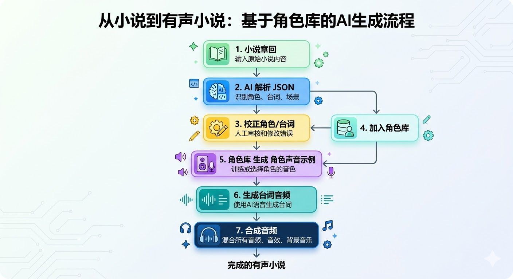

# AI-NovelSpeaker-V2

[简体中文](README.md) | [繁體中文](README.zh-TW.md) | [English](README.en-US.md) | [日本語](README.ja-JP.md) | [한국어](README.ko-KR.md)

多小说管理与有声生成工具（SQLite + 本地文件存储 + ComfyUI + LLM）。

## 小说转有声小说流程



## 视频介绍

- B站：https://www.bilibili.com/video/BV136AKzcE2c
- YouTube：https://youtu.be/pVB0qMpFdqg

## 社区交流

- QQ 群：`1104949466`


## 打赏支持

如果这个项目帮到了你，欢迎打赏支持继续开发。

| 支付宝 | 微信支付 |
| --- | --- |
|  |  |

## 功能概览

- 小说管理：创建/编辑/删除小说，项目统计，自动刷新，打包下载真实 ZIP，支持小说级提示词与工作流绑定，可刷新并缓存小说总音频时长
- 章节管理：章节 CRUD，正文查看与复制，章节搜索，AI 转 JSON，JSON 查看/编辑/查找替换，角色查看，台词预览与生成，章节音频播放/下载/合并
- 台词音频：支持单条生成、批量生成并进入台词任务队列，可立即或定时执行；任务页支持自动刷新、详情、播放、删除与 pending 数量显示
- 角色库：角色管理、等级筛选、章节角色对比，支持加入/替换角色库、示例音频上传/生成、声音文本提取
- 任务队列：JSON 任务队列与台词音频任务队列，支持状态查看、按小说筛选、自动刷新；音频合并前会提示未生成台词数量
- 提示词与工作流：系统/用户模板管理，可复制为用户模板；工作流按三类分组查看，支持输入输出节点配置、日志开关、系统/用户工作流切换
- 工作流日志：记录工作流调用时间、工作流类别、工作流名称、最终提交给 ComfyUI 的 JSON 与错误日志，支持清空全部日志
- 小说下载：提供小说章回音频下载页，展示章回编号、标题、字数、音频时长、音频大小与下载链接
- 系统配置：ComfyUI 地址、LLM 参数、Proxy、批量文本字数、台词队列执行方式、UI 语言与时区设置
- 多语言界面：支持 `zh-CN` / `zh-TW` / `en-US` / `ja-JP` / `ko-KR`
- 音频体验：章节音频、台词音频、合并音频支持拖动进度条快进
- 调试与文档：提供 ComfyUI debug 工作流、低显存工作流样例、调试音频样例与“小说转有声小说”流程图

## 目录说明

- `app_server.py`：服务入口
- `server/startup.py`：启动流程
- `server/http_handler.py`：HTTP 路由
- `server/services.py`：核心服务实现
- `scripts/init_storage.py`：初始化数据库与目录
- `prompts/xhz_system_prompt.txt`：系统提示词文件
- `workflows/*.json`：系统内置 ComfyUI 工作流文件
- `debug/`：ComfyUI 调试工作流截图、JSON 与调试音频样例
- `output/`：本地导出目录（保留目录本身，忽略目录内生成文件）

## 平台安装与启动

### 通用前置

- Python 3.10+（建议 3.11/3.12/3.13）
- 可选：ComfyUI（用于音频生成）

### 获取代码

```bash
 git clone git@github.com:qzw881130/AI-NovelSpeaker-V2.git
 # 或者: git clone https://github.com/qzw881130/AI-NovelSpeaker-V2.git
 cd AI-NovelSpeaker-V2
```

### macOS / Linux

```bash
chmod +x start.sh
./start.sh
```

查看帮助：

```bash
./start.sh --help
```

自定义端口（可选）：

```bash
./start.sh --port=8081
```

### Windows

直接双击 `start.bat`，或在 cmd / PowerShell 中执行：

```bat
start.bat
```

查看帮助：

```bat
start.bat --help
```

自定义端口（可选）：

```bat
start.bat --port=8081
```

## 启动脚本行为

`start.sh` / `start.bat` 会自动：

1. 检查并结束占用 `8080` 端口的旧进程
2. 若 `data/novels.db` 不存在，先执行初始化
3. 启动服务并打印可访问地址：
   - 本地地址：`http://127.0.0.1:8080/index.html`
   - 局域网地址：`http://<LAN_IP>:8080/index.html`

## 手动启动（可选）

首次初始化：

```bash
python3 scripts/init_storage.py
```

启动服务：

```bash
python3 app_server.py
```

## 打包下载规则（Download Bundle）

- ZIP 文件会先落盘到本地 `output/` 目录
- ZIP 文件名格式：`{小说英文名}-{YYYY-MM-dd_HHmm}.zip`
- 解压后不包含 `output/` 目录层级，结构为：
  - `{小说英文名}/audio/*.flac`
  - `{小说英文名}/text/*.txt`
- 文件命名规则：`章节编号_章节名`
  - 音频：`001_第一章_落日.flac`
  - 文本：`001_第一章_落日.txt`

## Windows 兼容性说明

- 项目核心路径使用 `pathlib.Path`，并在数据库中统一保存为 `/` 分隔符（`as_posix`），避免 Windows `\` 分隔符导致的前端路径显示/接口兼容问题。
- 静态页和 API 路由均使用 URL 标准 `/` 分隔符。
- `start.bat` 已增强局域网地址识别（优先 PowerShell，失败回退 `ipconfig` 解析）。

## ComfyUI 依赖说明

### 调试工作流与低显存样例

- `debug/qwen3-tts-generate-character-samples-no-llm.json`：Qwen3 TTS 角色示例音频生成
- `debug/fishaudio-s2-tts-generate-dialogue-audio.json`：Fish Audio S2 台词音频生成
- `debug/extract-voice-text.json`：Whisper 音频转文本
- `debug/line_audio_workflow_qwen3-tts.png`：Qwen3 TTS 低显存台词音频工作流截图
- `debug/voice_transcribe_workflow_qwen3-asr.png`：Qwen3-ASR 低显存提取文本工作流截图
- `debug/1-旁白.flac`：Fish Audio S2 调试工作流使用的参考音频样例

### 工作流配置说明

- 本项目现支持三类工作流：
  - `生成示例音频`
  - `生成台词音频`
  - `提取声音文本`
- 每个工作流都可以配置输入输出节点映射：
  - `生成示例音频`：输入 `音色描述`、`台词`；输出 `生成的声音文件`
  - `生成台词音频`：输入 `参考音频文件`、`台词`、`参考音频的文本`；输出 `生成的声音文件`
  - `提取声音文本`：输入 `音频文件`；输出 `提取的文本`
- 系统工作流使用默认映射，不允许编辑；复制为用户工作流后，会连同输入输出配置一起复制。
- 工作流日志默认开启。开启时，系统会记录“最终提交给 ComfyUI 的工作流 JSON”；关闭时，不再记录该工作流的执行日志。
- 工作流 JSON 既兼容 ComfyUI 的 API prompt 格式，也兼容图编辑器导出格式（`nodes/links` 结构）。

### 需要的第三方节点（仅列第三方）

| 插件（第三方） | 仓库 | 本项目工作流使用到的节点 |
| --- | --- | --- |
| Qwen3-TTS ComfyUI | [flybirdxx/ComfyUI-Qwen-TTS](https://github.com/flybirdxx/ComfyUI-Qwen-TTS) | `FB_Qwen3TTSVoiceDesign`、`FB_Qwen3TTSVoiceClone` |
| ComfyUI-FishAudioS2 | [Saganaki22/ComfyUI-FishAudioS2](https://github.com/Saganaki22/ComfyUI-FishAudioS2) | `FishS2VoiceCloneTTS` |
| ComfyUI_Comfyroll_CustomNodes | [Suzie1/ComfyUI_Comfyroll_CustomNodes](https://github.com/Suzie1/ComfyUI_Comfyroll_CustomNodes) | `CR Text` |
| ComfyUI-MTB | [melMass/comfy_mtb](https://github.com/melMass/comfy_mtb) | `Load Whisper (mtb)`、`Audio To Text (mtb)` |
| ComfyUI-Custom-Scripts | [pythongosssss/ComfyUI-Custom-Scripts](https://github.com/pythongosssss/ComfyUI-Custom-Scripts) | `ShowText\|pysssss` |
| Comfyui_SynVow_Qwen3ASR | [shumoLR/Comfyui_SynVow_Qwen3ASR](https://github.com/shumoLR/Comfyui_SynVow_Qwen3ASR) | `Qwen3ASRLoader`、`Qwen3ASRTranscribe` |

说明：`LoadAudio`、`SaveAudio`、`Text Multiline` 等节点来自 ComfyUI Core，不属于第三方节点。

### 需要的模型（按当前工作流）

- Qwen3 TTS：
  - `Qwen/Qwen3-TTS-12Hz-1.7B-Base`
  - `Qwen/Qwen3-TTS-12Hz-1.7B-VoiceDesign`
  - `Qwen3-TTS-1.7B`（低显存台词音频工作流）
- Fish Audio S2：
  - `s2-pro-fp8`
- Whisper 转写：
  - `large-v3`
- Qwen3 ASR：
  - `Qwen3-ASR-1.7B`

### 当前内置工作流与依赖对应关系

| 工作流文件 | 作用 | 关键第三方节点 | 需要的模型 |
| --- | --- | --- | --- |
| `workflows/voice_sample_workflow.json` | 生成角色示例音频 | `FB_Qwen3TTSVoiceDesign`、`CR Prompt Text` | `Qwen/Qwen3-TTS-12Hz-1.7B-Base`、`Qwen/Qwen3-TTS-12Hz-1.7B-VoiceDesign` |
| `workflows/line_audio_workflow.json` | 生成台词音频 | `FishS2VoiceCloneTTS`、`CR Prompt Text` | `s2-pro-fp8` |
| `workflows/voice_transcribe_workflow.json` | 从参考音频提取文本 | `Load Whisper (mtb)`、`Audio To Text (mtb)`、`ShowText\|pysssss` | [QwenLM/Qwen3-TTS](https://github.com/QwenLM/Qwen3-TTS) |
| `workflows/line_audio_workflow_qwen3-tts.json` | 低显存生成台词音频 | `FB_Qwen3TTSVoiceClone`、`CR Prompt Text` | `Qwen3-TTS-1.7B` |
| `workflows/voice_transcribe_workflow_qwen3-asr.json` | 低显存提取声音文本 | `Qwen3ASRLoader`、`Qwen3ASRTranscribe`、`ShowText\|pysssss` | [shumoLR/Comfyui_SynVow_Qwen3ASR](https://github.com/shumoLR/Comfyui_SynVow_Qwen3ASR) |

## 页面入口

- `index.html`：小说管理
- `chapters.html`：章节管理
- `json-tasks.html`：JSON 任务
- `audio-queue.html`：有声队列
- `line-audio-tasks.html`：台词音频任务队列
- `roles.html`：角色库
- `novel-download.html`：小说下载
- `prompts.html`：提示词管理
- `workflows.html`：工作流管理
- `workflow-logs.html`：工作流日志
- `settings.html`：系统配置
- `novel-capture.html`：小说抓取
